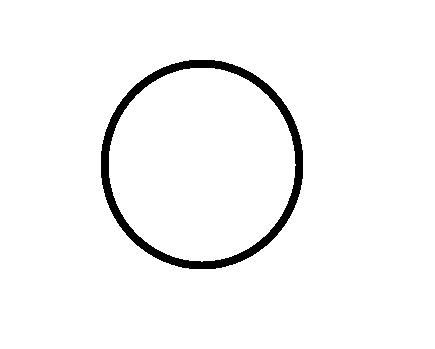
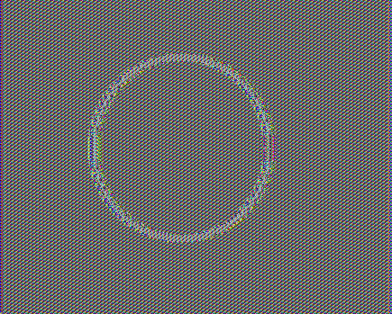

# Electronic-codebook-ECB
## This code depicts that ECB mode of encryption reveals information.

Contributors: Saad Islam and Inam Ul Haq

## Test input image
"circle_plain.bmp" is our input image in plain form as follow:

## Encrypted output image
"circle_encrypted.x" is the AES encrypted version of "circle_plain.bmp" in ECB mode.

Run ebc_test.m in MATLAB to view the encrypted image "circle_encrypted.x":

## References

https://en.wikipedia.org/wiki/Block_cipher_mode_of_operation
